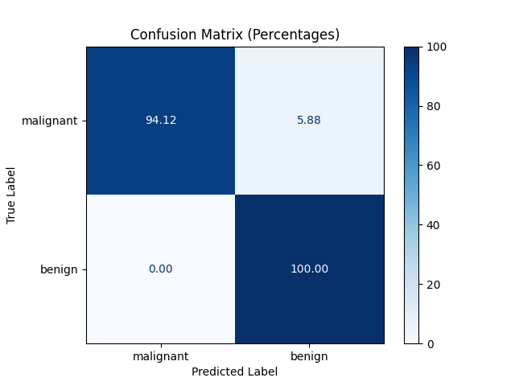

# BreastCancerAI

School project for the course of Artificial Intelligence, the goal is to create a model 
that can predict if a person has breast cancer or not based on a dataset.

## :file_folder: Dataset

Contain the dataset we picked.

`Note : Predict whether the cancer is benign or malignant`
https://archive.ics.uci.edu/dataset/17/breast+cancer+wisconsin+diagnostic

### :information_source: Dataset Information

Number of classes: 2 
- Malignant
- Benign

Number of features: 30

### :page_facing_up: Attribute Information

- radius_mean: Mean of distances from center to points on the perimeter
- texture_mean : Standard deviation of gray-scale values
- perimeter_mean : mean size of the core tumor
- area_mean : mean area of the core tumor
- smoothness_mean : mean of local variation in radius lengths
- compactness_mean : mean of perimeter^2 / area - 1.0
- concavity_mean : mean of severity of concave portions of the contour
- concave points_mean : mean for number of concave portions of the contour
- symmetry_mean
- fractal_dimension_mean : mean for "coastline approximation" - 1
- radius_se : standard error for the mean of distances from center to points on the perimeter
- texture_se : standard error for standard deviation of gray-scale values
- perimeter_se : 
- area_se : standard error for area of the core tumor
- smoothness_se : standard error for local variation in radius lengths
- compactness_se : standard error for perimeter^2 / area - 1.0
- concavity_se : standard error for severity of concave portions of the contour
- concave points_se : standard error for number of concave portions of the contour
- symmetry_se
- fractal_dimension_se : standard error for "coastline approximation" - 1
- radius_worst : "worst" or largest mean value for mean of distances from center to points on the perimeter
- texture_worst : "worst" or largest mean value for standard deviation of gray-scale values
- perimeter_worst : "worst" or largest mean value for meam size of the core tumor
- area_worst : "worst" or largest mean value for area of the core tumor
- smoothness_worst : "worst" or largest mean value for local variation in radius lengths
- compactness_worst : "worst" or largest mean value for perimeter^2 / area - 1.0
- concavity_worst : "worst" or largest mean value for severity of concave portions of the contour
- concave points_worst : "worst" or largest mean value for number of concave portions of the contour
- symmetry_worst
- fractal_dimension_worst : "worst" or largest mean value for "coastline approximation" - 1

### :newspaper: Number of lines

- Total number of lines: 569
- Number of lines with class M (Malignant): 212
- Number of lines with class B (Benign): 357


### :bar_chart: Model used & Results

- `Decision Tree` : 89% of the time the model is right
- `KNN` : 96% of the time the model is right
- `SVM` : 98% of the time the model is right
- `Random Forest` : 96% of the time the model is right

### :chart_with_upwards_trend: Confusion Matrix visualization (SVM)



- True Positives (TP): 94% of the cases were correctly classified as "Malignant".
- False Negatives (FN): 6% of the cases were incorrectly classified as "Benign" when it was actually "Malignant".
- False Positives (FP): 0% of the cases were incorrectly classified as "Malignant" when they were actually "Benign".
- True Negatives (TN): 100% of the cases were correctly classified as "Benign".

**In this context:**

- "Malignant" represents the positive class.
- "Benign" represents the negative class.


### :memo: Conclusion

Overall, the model is pretty accurate, the best model is the `SVM` with 98% of accuracy. 
But all the models are pretty close to each other, so we can say that the dataset is 
pretty good and the models are well trained.

## :rocket: How to run the project

```bash
# Clone this repository
git clone https://codefirst.iut.uca.fr/git/nathan.boileau/BreastCancerAI.git

# Go into the repository
cd BreastCancerAI

# Install the dependencies
pip install -r requirements.txt

# Run the project
python main.py
```
